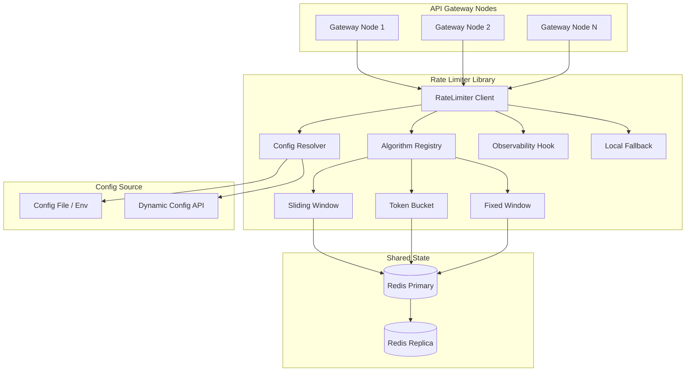
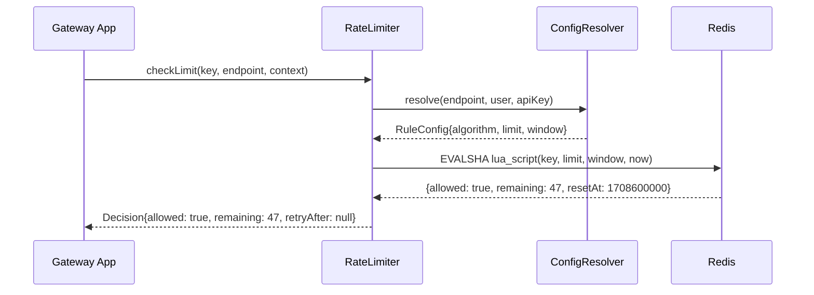
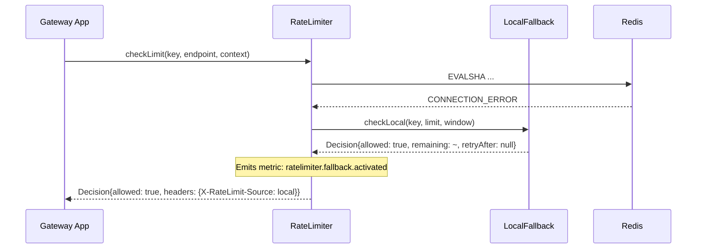

# Distributed Rate Limiter — Architecture Design

## Summary

This document describes a distributed rate limiter designed for multi-node API gateways. The system uses Redis as a shared state backend, supports three algorithms (sliding window log, token bucket, fixed window counter), and exposes a simple synchronous check-and-decrement API. Each gateway node is a stateless client; all coordination happens through atomic Redis operations (Lua scripts), eliminating the need for inter-node communication or consensus protocols. A local fallback mode degrades gracefully when Redis is unreachable.

---

## Component Diagram



---

## Data Flow

### Happy Path (Request Allowed)



### Failure Path (Redis Unavailable)



---

## Algorithm Descriptions

### 1. Fixed Window Counter

- **Key format:** `rl:fw:{identifier}:{window_start_epoch}`
- **Redis operations:** `INCR` + `EXPIRE` (single Lua script, atomic)
- **Behavior:** Counts requests in discrete time buckets. Simple and fast. Susceptible to burst at window boundaries (up to 2× limit across two adjacent windows).
- **Use when:** Simplicity matters more than precision; billing/quota scenarios.

### 2. Sliding Window Log

- **Key format:** `rl:sw:{identifier}`
- **Redis operations:** `ZREMRANGEBYSCORE` + `ZCARD` + `ZADD` (single Lua script)
- **Behavior:** Stores timestamps of each request in a sorted set. Trims entries outside the window, counts remaining. Precise but memory-intensive for high-throughput keys.
- **Use when:** Accuracy matters; moderate request volume per key.

### 3. Token Bucket

- **Key format:** `rl:tb:{identifier}` (hash with `tokens`, `last_refill`)
- **Redis operations:** Single Lua script computes elapsed time, refills tokens, decrements.
- **Behavior:** Allows bursts up to bucket capacity, then rate-limits to refill rate. Most flexible for APIs that tolerate short bursts.
- **Use when:** Burst tolerance is desired; streaming or real-time APIs.

All algorithms are implemented as **atomic Lua scripts** executed server-side in Redis. This eliminates race conditions between nodes without requiring distributed locks.

---

## Key Design: Identifier Resolution

The rate limit key is constructed by the **Config Resolver** based on the rule hierarchy:

```
Priority (highest → lowest):
  1. Per API-key + endpoint override
  2. Per user + endpoint
  3. Per API-key (global)
  4. Per user (global)
  5. Per endpoint (global)
  6. Default
```

Multiple rules can apply simultaneously (e.g., a user has both a per-user limit and a per-endpoint limit). The limiter checks **all applicable rules** and rejects if **any** rule is exceeded.

---

## Failure Handling

| Failure Mode | Detection | Response | Recovery |
|---|---|---|---|
| Redis primary down | Connection error / timeout (50ms) | Switch to local in-memory fallback (per-node token bucket) | Automatic reconnect with exponential backoff; resume Redis on success |
| Redis slow (>50ms) | Timeout threshold | Same as above | Same as above |
| Clock skew between nodes | N/A — timestamps come from Redis `TIME` command, not local clocks | Consistent across nodes | None needed |
| Config source unavailable | Load error | Use last-known-good config cached in memory | Retry on next request |
| Lua script missing (NOSCRIPT) | Redis error | Re-upload script via `SCRIPT LOAD`, retry once | Automatic |
| Memory pressure on Redis | `OOM` error | Allow request (fail-open), emit alert metric | Operator intervention |

### Fail-Open vs Fail-Closed

**Default: fail-open.** When the rate limiter cannot determine the correct answer, it allows the request and emits a metric. This prevents the rate limiter from becoming a single point of failure for the entire gateway. Operators can configure fail-closed for security-sensitive endpoints.

---

## Observability

### Metrics (counters/gauges/histograms)

| Metric | Type | Labels |
|---|---|---|
| `ratelimiter.check.total` | Counter | `algorithm`, `decision` (allowed/denied) |
| `ratelimiter.check.latency_ms` | Histogram | `algorithm`, `backend` (redis/local) |
| `ratelimiter.redis.errors` | Counter | `error_type` |
| `ratelimiter.fallback.active` | Gauge | `node_id` |
| `ratelimiter.keys.active` | Gauge | `algorithm` |

### Logging

Structured log events emitted at key points:
- `rate_limit_denied` (WARN): includes key, limit, current count, algorithm
- `fallback_activated` (WARN): includes node, reason, duration
- `config_reload` (INFO): includes diff summary

### Response Headers

Standard headers on every response:
- `X-RateLimit-Limit` — configured limit
- `X-RateLimit-Remaining` — remaining requests
- `X-RateLimit-Reset` — UTC epoch when the window resets
- `Retry-After` — seconds to wait (only on 429 responses)

---

## Deployment Topology

The rate limiter is a **library** embedded in each gateway node, not a separate service. This eliminates network hops for the check call. The only external dependency is Redis.

Recommended Redis setup: **Redis Sentinel** or **Redis Cluster** for HA. A single Redis primary can handle ~100K+ rate limit checks/second (Lua script overhead is minimal). For larger deployments, shard by key prefix across Redis Cluster hash slots.

---

## Open Questions

1. **Multi-region:** Should rate limits be global (single Redis) or regional (per-region Redis with eventual sync)? Global is simpler but adds cross-region latency.
2. **Rate limit response format:** Should denied requests return a machine-readable body (JSON with reset time, quota info) or just the 429 + headers?
3. **Dynamic config hot-reload:** Should config changes take effect immediately or at the next window boundary to avoid mid-window inconsistencies?
4. **Cost of sliding window log:** For high-cardinality keys (millions of unique users), the sorted set memory cost may be prohibitive. Should we default to fixed window and make sliding window opt-in?
